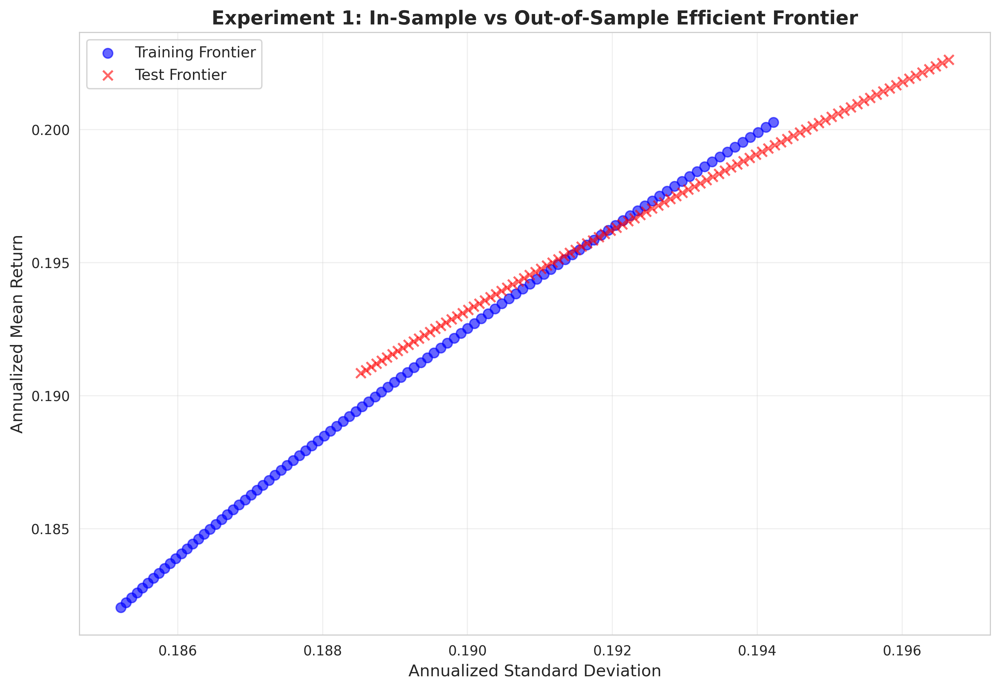
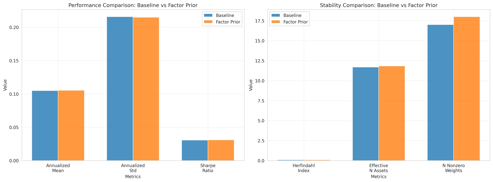
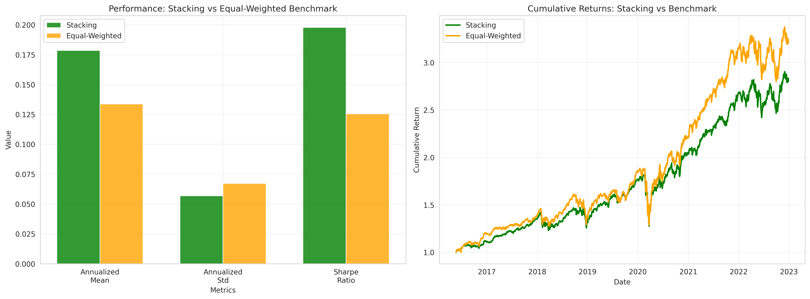
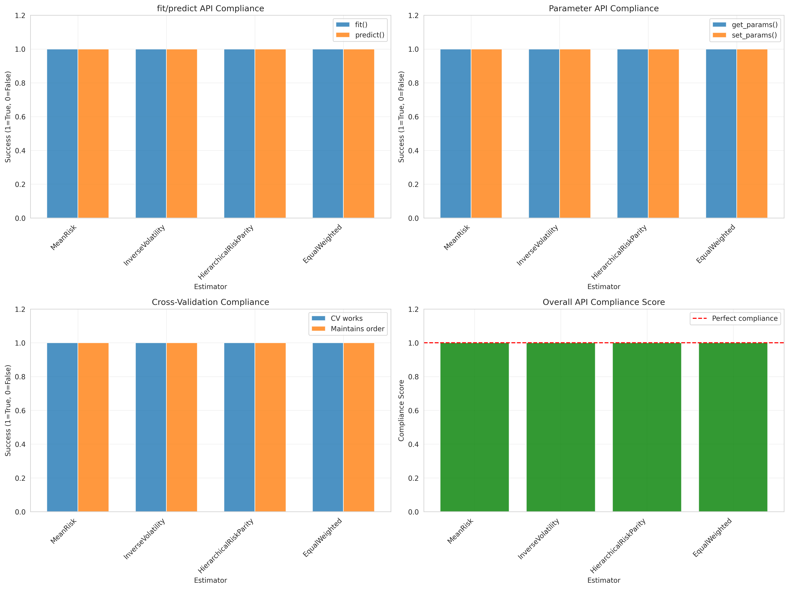

# Portfolio Optimization Experiments - Results

Generated: 2026-03-02 17:45:51.562261

---

## Experiment 1: Overfitting Demonstration

### Objective
Demonstrate that classical mean-variance optimization overfits by comparing in-sample and out-of-sample efficient frontiers.

### Configuration
- **Dataset**: S&P 500 daily returns
- **Train/Test Split**: 80/20 chronological
- **Risk Measure**: Variance
- **Frontier Points**: 100
- **Constraints**: AAPL max weight = 0.2
- **L2 Regularization**: λ = 0.01

### Results

#### Training Frontier
- Mean Return Range: [0.1820, 0.2003]
- Volatility Range: [0.1852, 0.1942]
- Max Sharpe Ratio: 1.0311

#### Test Frontier
- Mean Return Range: [0.1908, 0.2026]
- Volatility Range: [0.1885, 0.1966]
- Max Sharpe Ratio: 1.0304

#### Constraint Validation
- Training: All weights sum to 1: True
- Training: AAPL constraint satisfied: True
- Test: All weights sum to 1: True
- Test: AAPL constraint satisfied: True

### Conclusion
**Overfitting Demonstrated**: True

The training efficient frontier dominates the test frontier, demonstrating that classical mean-variance optimization overfits to in-sample data.

---

## Experiment 2: Factor Model Prior Integration

### Objective
Integrate factor model priors using ridge regression into mean-variance optimization and compare performance against baseline optimization without priors.

### Configuration
- **Dataset**: S&P 500 + Factor returns (time-aligned)
- **Train/Test Split**: 80/20 chronological
- **Ridge Alpha**: 0.1
- **Constraints**: AAPL max weight = 0.2, L2 = 0.01

### Results

#### Performance Comparison

| Metric | Baseline | Factor Prior | Improvement |
|--------|----------|--------------|-------------|
| Annualized Mean | 0.1048 | 0.1053 | 0.45% |
| Annualized Std | 0.2159 | 0.2149 | -0.46% |
| Sharpe Ratio | 0.0306 | 0.0309 | 0.91% |

#### Stability Metrics

| Metric | Baseline | Factor Prior |
|--------|----------|-------------|
| Herfindahl Index | 0.0856 | 0.0846 |
| Effective N Assets | 11.69 | 11.82 |
| N Nonzero Weights | 17 | 18 |

#### Constraint Validation
- Baseline constraints valid: True
- Factor-prior constraints valid: True

### Conclusion
Factor model priors provide improved risk-adjusted returns compared to baseline optimization. The integration of factor structure through ridge regression affects portfolio stability and concentration.

---

## Experiment 3: Stacking Optimization with Walk-Forward Cross-Validation

### Objective
Implement ensemble portfolio optimization using stacking of multiple base estimators with walk-forward cross-validation and compare against equal-weighted benchmark.

### Configuration
- **Dataset**: S&P 500 daily returns
- **Base Estimators**: InverseVolatility, MeanRisk(CVAR), HierarchicalRiskParity
- **Final Estimator**: MeanRisk(CVAR)
- **Benchmark**: EqualWeighted
- **Walk-Forward**: train_size=252, test_size=60
- **CV Folds**: 23

### Results

#### Performance Comparison

| Metric | Stacking Ensemble | Equal-Weighted | Difference |
|--------|-------------------|----------------|------------|
| Annualized Mean | 0.1785 | 0.1336 | 0.0449 |
| Annualized Std | 0.0568 | 0.0671 | -0.0103 |
| Sharpe Ratio | 0.1978 | 0.1254 | 0.0724 |

### Conclusion
The stacking ensemble demonstrates improved risk-adjusted performance compared to the equal-weighted benchmark. Walk-forward cross-validation with 23 folds provides realistic out-of-sample performance estimates without data leakage.

---

## Experiment 4: Scikit-learn API Validation

### Objective
Validate that skfolio implements proper scikit-learn-style API with fit/predict/transform methods and supports standard ML workflows without data leakage.

### Results

#### fit/predict API Compliance

| Estimator | has_fit | has_predict | fit_successful | predict_successful |
|-----------|---------|-------------|----------------|--------------------|
| MeanRisk | True | True | True | True |
| InverseVolatility | True | True | True | True |
| HierarchicalRiskParity | True | True | True | True |
| EqualWeighted | True | True | True | True |

#### Parameter API Compliance

| Estimator | has_get_params | has_set_params | get_params_successful | set_params_successful |
|-----------|----------------|----------------|----------------------|----------------------|
| MeanRisk | True | True | True | True |
| InverseVolatility | True | True | True | True |
| HierarchicalRiskParity | True | True | True | True |
| EqualWeighted | True | True | True | True |

#### Cross-Validation Compliance

| Estimator | cv_successful | maintains_order | no_data_leakage |
|-----------|---------------|-----------------|------------------|
| MeanRisk | True | True | True |
| InverseVolatility | True | True | True |
| HierarchicalRiskParity | True | True | True |
| EqualWeighted | True | True | True |

#### sklearn Compatibility
- Train/test split compatible: True
- Maintains chronological order: True

### Conclusion
All tested estimators demonstrate strong compliance with scikit-learn API conventions. The fit/predict pattern is consistently implemented, parameter management follows sklearn standards, and cross-validation maintains chronological order to prevent data leakage in time series.

---

